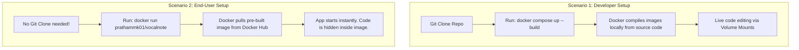
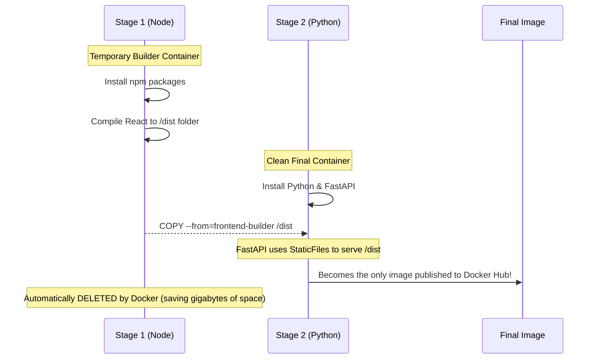

# My Docker & Deployment Learning Log

This document serves as a structured review of the core concepts learned regarding Docker, deploying AI apps, handling large models, and multi-stage builds.

---

## 1. Handling Massive AI Models with Docker

Because GitHub has a strict **100MB file limit**, massive AI models (like `.gguf` files) cannot be pushed directly to the repository. We learned two main ways to solve this for Docker users:

### The "Bake It In" Approach
- **How:** Use `wget` in the `Dockerfile` to download the 4GB models while the image is building.
- **Result:** The user pulls a massive 5GB image. It works instantly offline but takes forever to download/push.

### The "Auto-Download" Approach (Recommended)
- **How:** The Docker image is kept tiny (~500MB). When the Python app starts, it checks if the models exist. If not, it uses `urllib.request` to download them.
- **The Magic:** By combining this with a **Docker Volume Mount** (`~/Downloads/VocalNote_models:/app/models`), the container saves the models *directly to the user's host PC*. If they restart the container tomorrow, the models are already there!

---

## 2. Docker Volumes (The "Live Mirror")

Volumes punch a hole through the isolated walls of a Docker container.

```yaml
volumes:
  - ./backend:/app
```

> [!NOTE]
> **What this does:** It creates a two-way sync (Bind Mount) between the Mac's `./backend` folder and the container's `/app` folder.
> **Why it matters:** Without this, the container uses a static "snapshot" of the code (`COPY . .`). With this, editing a `.py` file on the Mac instantly updates the code inside the container, allowing `uvicorn --reload` to work its magic without needing to rebuild the image!

---

## 3. The Two Paradigms of Docker Distribution

We learned that there are two completely different ways a project is shared using Docker.



---

## 4. The Apple Silicon (Mac) Limitation

> [!WARNING]
> **Docker on Mac = CPU Only**
> Docker on macOS actually runs inside a lightweight Linux Virtual Machine. Apple does **not** allow this Linux VM to access the Mac's GPU (Metal/MPS).

Because of this limitation, any code running inside a Mac Docker container is completely blind to the GPU. 
- **The Fix:** We must explicitly install the CPU version of `llama-cpp-python` in the Dockerfile.
- **The Tradeoff:** If a Mac user wants blazing-fast Metal GPU speeds, they *must* run the app traditionally (Option B in the README) outside of Docker.

---

## 5. Multi-Stage Builds (The "Monolith" Image)

We learned that **React doesn't need Node.js in production.** Running `npm run build` squashes the entire React app into a few static HTML/CSS/JS files inside a `dist/` folder. Any web server (like FastAPI) can serve these!

This allows us to merge two containers (Frontend + Backend) into a **single Docker image** using a Multi-Stage Dockerfile.



### How FastAPI serves it:
```python
# 1. Serves the static assets (CSS/JS files)
app.mount("/assets", StaticFiles(directory="dist/assets"), name="assets")

# 2. Serves the main HTML page
@app.get("/")
async def serve_frontend():
    return FileResponse("dist/index.html")
```

> [!TIP]
> **The Result:** The user only has to pull one image and run one command (`docker run prathammk01/vocalnote`). They open port `9000` in their browser, and FastAPI serves them the React interface!

---

## 6. The `.dockerignore` Disk Crash

We discovered why Docker Desktop can suddenly crash with an `input/output error` during a build.

When you run `COPY backend/ .`, Docker attempts to copy the *entire* local folder into the build context. Because the local `backend/models/` folder contained 4GB of downloaded GGUF files, Docker tried to ingest all 4GB into the temporary image layer, instantly filling up the Docker Virtual Machine's disk and locking the internal database!

- **The Fix:** Create a `.dockerignore` file in the root directory.
- **How it works:** It acts exactly like `.gitignore`. By adding `backend/models/`, we strictly forbid Docker from ever copying those massive files into the image, keeping the build context tiny (a few MBs) and lightning fast.

---

## 7. Multi-Architecture Builds (The Windows/Mac Divide)

We hit a classic Docker "gotcha" when a Windows laptop tried to pull our Mac-built image and threw the error:
`no matching manifest for linux/amd64 in the manifest list entries`

> [!IMPORTANT]
> **The Architecture Divide:**
> - **Macs (Apple Silicon Series)** use **ARM** architecture (`linux/arm64`).
> - **Windows Laptops (Intel/AMD)** use **x86** architecture (`linux/amd64`).

By default, `docker build` compiles an image *only* for the host machine's architecture. When Windows asked Docker Hub for the image, Docker Hub didn't have an Intel-compatible version!

### The Fix: Docker Buildx
We can use Docker's powerful `buildx` tool to build for multiple architectures simultaneously:
```bash
docker buildx build --platform linux/amd64,linux/arm64 -t prathammk01/vocalnote --push .
```
This runs two parallel builds (Mac will emulate the Intel processor for the `amd64` build) and pushes them under the exact same tag. When a user runs `docker pull`, Docker Hub automatically detects their OS and sends them the correct version!
